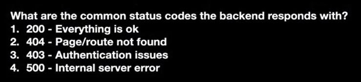

//What is ECMAScript?
/* 
What is Javascript?

What is Node.js?

What is Bun?

What is an HTTP Server?
    ---Some code that follows the HTTP Protocol
    Ang is able to communicate with clients (browsers/mobile apps...)
    Think of it to be similar to the call app in your phone
    Which lets you communicate with your friends */
    
  

  

  

  

  What are the common methods you can send to your BE server?

  

  

  

  Status codes
  